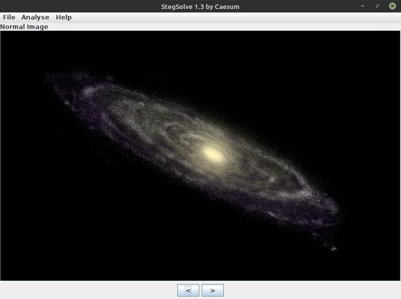
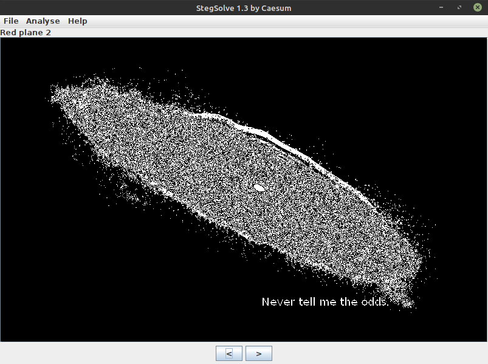
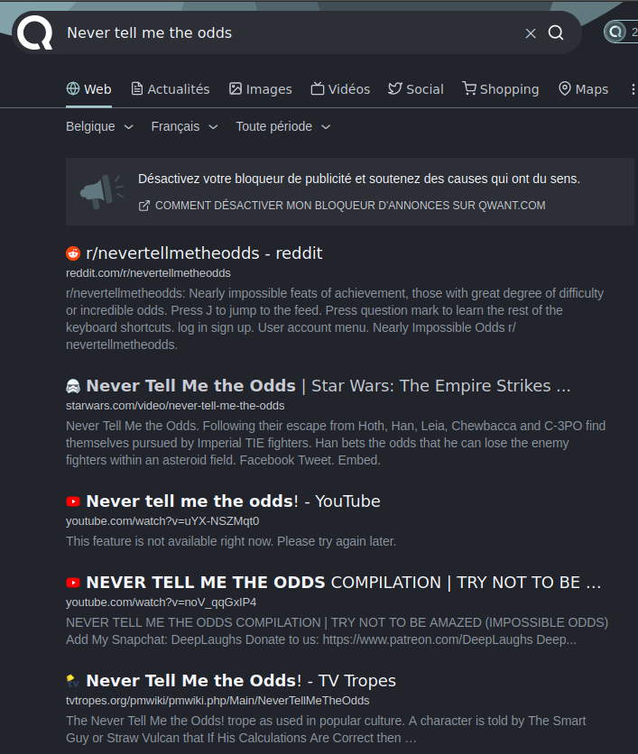

## A trip in space

### Énoncé


L'image que l'on reçoit est la suivante :


### Solution

Un petit test avec la commande ```file stegano2.png``` ne révèle rien d'anormal :
```bash
$file stegano2.png
stegano2.png: PNG image data, 800 x 500, 8-bit/color RGBA, non-interlaced
```

Avant de passer à de la recherche plus poussée avec des commandes comme ```strings``` ou ```exiftool```,
c'est toujours bon de passer l'image dans un programme spécifique pour vérifier si quelque chose n'a pas été caché dans des pixels de couleurs ou dans le [LSB](https://fr.wikipedia.org/wiki/St%C3%A9ganographie).

De multiple programmes existent, j'utiliserai ici *stegsolve* et *steganabara*. Le recours à des sites tels que [CyberCheef](https://gchq.github.io/CyberChef/) est également utile. *Stegsolve* est utile pour passer rapidement en revue les filtres d'images. *Steganabara* est utile pour analyser en profondeur une image comme il y a moyen de choisir précisément quels bits afficher, et permet également de zoomer sur l'image.



On peut rapidement passer sur plusieurs filtres à l'aide des flèches directionnelles, comme l'inversion de couleur (Xor), les calques de bit de transparence, et ce qui nous intéresse ici, les calques de bits de couleur. En effet, quand on passe en revue les différents bits de couleur, on se rend compte d'une chose.



On a réussi à trouver la phrase cachée dans l'image.

Maintenant ce n'est pas fini. En effet, l'énoncé dit "Qui est la personne ayant dit la phrase cachée dans cette image ?", cela ne sert donc à rien d'essayer la phrase directement sur le site (:wink:).

Pour cela, Google (ou équivalent) est votre meilleur ami !



Et on trouve très vite qu'il s'agit de **Han Solo** dans *Star Wars: The Empire Strikes Back* qui dit cette phrase. On a trouvé notre flag.
