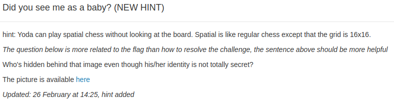
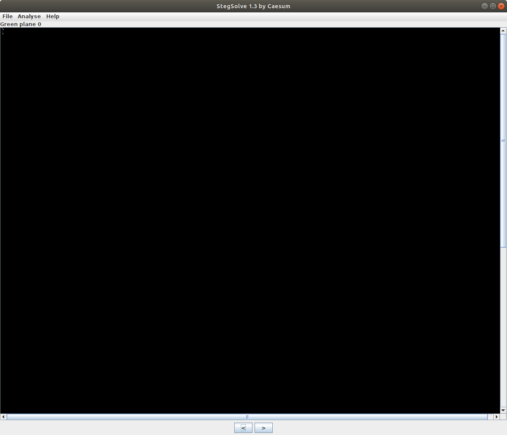

## Did you see me as a baby ?



L'image du challenge est la suivante:


Ce challenge est clairement de la steganographie comme l'indique le nom. Premièrement on peut inspecter l'image avec stegsolve. Ainsi, on peut noter quelque chose d'étrange, le bit plane vert 0 est presque entièrement à 0 à part quelques pixels.



Comme vous pouvez le voir quelques pixels sont activé dans le coin en haut à gauche. Pour examiner ces valeurs, on a fait un petit script python. On a d'abord remarqué que toutes les valeurs étaient dans un "rectangle" de 16 lignes et 8 colonnes. Etant donné qu'un char est de 8 bits, on a essayé de convertir chacune des 16 lignes comme un char de 8 bits. Mais comme l'output du script (donné ci dessous) le montre, ça n'a pas donné grand chose d'intéressant.

```
00011000000000000000100000000001000000100000001000000000000000000000000000000000000010000000000000000000000000100000001000000100
[24, 0, 8, 1, 2, 2, 0, 0, 0, 0, 8, 0, 0, 2, 2, 4]
```

Vu qu'il y a très peu de bits à 1, la solution est forcément autre part. Après un moment de réflexion, on a affiché les coordinées de chaque pixel "activé":

```
0,3 = 1
0,4 = 1
2,4 = 1
3,7 = 1
4,6 = 1
5,6 = 1
10,4 = 1
13,6 = 1
14,6 = 1
15,5 = 1
```

On soudain on l'a vu, et un oeil entrainé pourra aussi le remarquer. Tous les nombres peuvent être exprimés comme un chiffre hexadécimal. Mais également si on prend l'hexadécimal comme "colonne|ligne" on a des nombres qui tombent presque tous dans les lettres ascii. Donc si on interprète ces nombres comme des ascii, on obtient:

```
0@BsdeJmn_
```

Maintenant, il faut se rappeler le hint sur le flag (ça nous a pris un bon moment avant de se rendre compte que le flag était sous nos yeux :'( ). L'indice nous dit que le flag est une personne dont l'identité n'est pas totalement secrète. En regardant bien les charactères qu'on a on peut reconstruire:

```
J@mes_B0nd
```

Qui est le flag. Vous pouvez trouvez le script dans [analyse_yoda.py](analyse_yoda.py).
