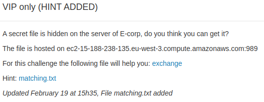

## VIP only



La première étape pour résoudre ce challenge est d'explorer l'url fourni. Une simple requête dessus via un naviguateur montre 2 informations :
- on reçoit une chaine de caractère (Authentication failed) avec une série de bytes random.
- on ne reçoit pas de réponse en HTTP.

On peut encore [se renseigner sur le port 989](https://en.wikipedia.org/wiki/List_of_TCP_and_UDP_port_numbers). On trouve qu'il s'agit d'un des deux ports utilisé pour FTPS (FTP over SSL).

_TODO: insérer screen_

La deuxième étape est la lecture de la trace réseau fournie avec Wireshark.

La première info que l'on peut en tirer est qu'il n'y a que du traffic TCP, ce qui explique que l'on n'obtienne pas de réponse HTTP.
Il est aussi à noter qu'il n'y a pas de trace de SSL, le port est donc éventuellement une fausse piste.

Ensuite, on observe plusieurs 3-way handshake, ce qui nous indique que la trace contient plusieurs connexions sur le serveur. Wireshark permet de lire le contenu de chaque session TCP en suivant `Statistiques > Conversations > TCP` dans les menu. Une méthode alternative (et moins précise) est de lire tous les strings contenues dans le fichier `strings <file>.pcap`.


On constate que la capture contient 11 sessions TCP et que la première représente un échange d'informations plus importantes que les 10 suivantes. En cliquant sur `Follow Stream`, on peut suivre le contenu de la première session :


La première ligne indique qu'il existe effectivement une forme d'authentification non encryptée vers le serveur, ce qui implique que toutes les info d'authentification se trouvent en clair dans la trace.

Les lignes suivantes indiquent des commandes telles que `LIST` ou `GET <file>`, qui sont des [commandes valides du protocole FTP](https://en.wikipedia.org/wiki/List_of_FTP_commands). On a donc un programme côté serveur qui imite le comportement de FTP.

Dernière info mais non des moindres, il existe un fichier `flag.txt` sur le serveur.

A ce stade ci, on sait que la communication avec le serveur :
- se fait en raw TCP
- imite des commandes de FTP
- contient une forme d'authentification

A ce moment, j'ai fait quelques tests avec `telnet` mais sans succès. 

Il reste à comprendre comment marche "l'authentification" en lisant la trace.

Le screenshot suivant montre la phase d'authentification de la première session TCP avec la ligne bleue correspondant au message `Valid authentication`.


Les 3 premières lignes correspondent au classique 3-way handshake de TCP et rien ne semble sortir de l'ordinaire dans l'échange des options. La suite de l'échange est plus intriguante.

La 4 ligne montre que directement après le handshake, le serveur envoie des données au client, en l'occurence 4 bytes


Le client ack la réception des 4 bytes et répond immédiatement avec également 4 bytes.


Ensuite, le serveur ack les données du client et répond `Valid authentication`.

Un simple filtre permet d'isoler tous les bytes envoyés par les clients vers le serveur : `tcp.dstport==989 && tcp.flags.push == 1 && tcp.len == 4`. On obtient de cette manière les différents mots envoyés par les clients au serveur.

Ici j'ai tenté de trouver une corrélation entre ces mots et ceux envoyés par le serveur, mais je me suis vite rendu compte que le serveur envoie des bytes random. Aussi le plus simple maintenant est de scripter avec scapy une ouverture de session TCP offrant à chaque itération un des mots extraits et tenter de `GET flag.txt`

``` python
import scapy
import socket
from scapy.supersocket import StreamSocket
from scapy.packet import Raw
import time

b = ["\x5d\x00\x00\x00",
        '\x1b\x00\x00\x00',
        '\x38\x00\x00\x00',
        '\x1f\x00\x00\x00',
        '\x1f\x00\x00\x00',
        '\x3e\x00\x00\x00',
        '\x38\x00\x00\x00',
        '\x1f\x00\x00\x00',
        '\x3a\x00\x00\x00',
        '\x28\x00\x00\x00',
        '\x3c\x00\x00\x00',
        ]

#b = ['\x1f\x00\x00\x00']

for i in b:
    s = socket.socket()
    s.connect(('ec2-15-188-238-135.eu-west-3.compute.amazonaws.com',989))
    ss=StreamSocket(s,Raw)
    a = ss.sr1(Raw(i))
    if a:
        print(a.load)
    time.sleep(0.1)
    r = ss.sr1(Raw('GET flag.txt\x0a'))
    time.sleep(1)
    if r:
        print(r.load)
    s.close()
    time.sleep(0.1)
```

Suite à des difficultés à récupérer les réponses du serveur via scapy, j'ai ajouté des délais et monitoré le traffic réseau avec Wireshark.

Par chance, l'un des mots a été accepté ce qui a donné une authentification valide et la récompense est obtenue :


