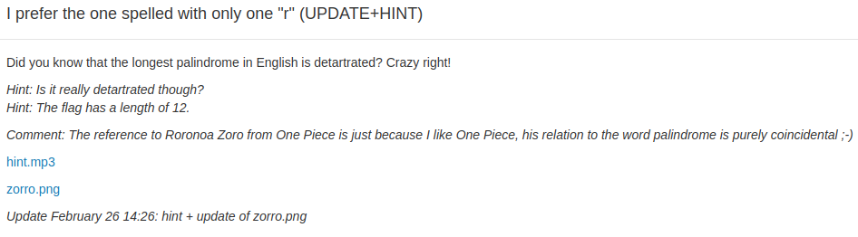

## I prefer the one spelled with one 'r'



For this challenge, there is two files, the first one is an image and the other one is named "hint.mp3" but is certainly not an audio file. To verify what it is, just open the terminal and type:

```
$ file hint.mp3
hint.mp3: GPG symmetrically encrypted data (AES cipher)
```

You clearly get an encrypted text with GPG. So we found that in the command line you can decrypt a gpg file with the command:

```
gpg -d hint.mp3
```

But it opens a window and asks for the passphrase. After some tests, we understood that we will need to brute force this passphrase. (Even though with the hint indicated now, it is far much easier, we didn't had it when we solved this problem so we struggled a little.)

To brute force this, we used the tool gpg2john to transform the gpg file into a file that john the ripper can understand then we launched john on the file. After 30 minutes we stopped and we decided to modify the rules of john to make a palindrome but it was a big loss in time.

In fact, after some thinking, we just made a wordlist containing the top 20 palindromes in english and john found the results wich is `taTtaRraTtat`.

Once it was done, we decrypted the hint.mp3 and it gave us a list of numbers:

```
1147 6427 14103 16087 16580 20180 44011 44286 48217 56623 56840 57141 59490 61167 65996 67340 69583 71527 77985 78736 83227 85313 90783 107008 107230 109625 110475 111674 126971 132678 156454 169584 171375 175731 186266 194702 194846 195169 197868 203139 204671 204841 207169 207191 208117 208614 218301 220359 222370 222797 224473 226469 230187 233035 234630 240297 261327 261652 273831 284368 285483 290151 297636 301816 307820 309523 311121 317128 320047 333231 335584 335895 337727 345539 349113 358569 362834 367488 377668 382573 384982 391251 393234 393404 395470 395638 400930 406999 414763 416654 417696 425616 427444 434386 435704 439022
```

We first thought it was the indices of bytes in the file "zorro.png" but we realised that the image was only 196kB which is less than half the higher number of the list. So after some time, we discovered that there was 456300 pixels in this image. That's it, the numbers are the indices of the pixels in the image.

So we made a little script with python-opencv to load the image and to get the pixel at the indices of the given list. But there was no pattern really visible. But later, we had another idea, as we have 96 numbers and the flag was 12 character, it means that we only need one bit for each number of the list. So we took the lsb of each number (so the parity bit), you just have to do a `%2` to get this bit.

It gives us the following list:

```
111011001010110010001100111110100100110011000010101000101100101011111010100100101100001011101010
```

This translate to nothing but if you reverse the order then decode in ascii:

```
WCI_SEC2_157
```

You can find the script in [soluce.py](soluce.py).
