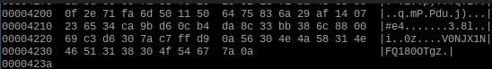

## Mirror

Ce challenge a clairement été créé pour mener à plusieurs fausses pistes.

Tout premièrement, j'ai analysé l'image et essayé de comprendre ce que pouvait signifier les chiffres, j'ai même retrouvé l'image originale utilisée mais c'était effectivement une fausse piste.

Il s'agissait simplement d'une chaine de caractère ajoutée à la fin du fichier. Elle est visible en passant l'image dans `hexdump` et en cherchant la balise de fin du format PNG, à savoir `ff d9`. Tout ce qui se trouve après cette balise est inutile pour afficher l'image.

On obtient donc `V0NJX1NFQ180OTgz`.

Cette ligne est très peu indicative mais il s'agit en fait d'un grand classique des CTF, le base64 qui d'habitude est reconnaissable par les "=" à la fin pour le padding mais qui ne sont pas présent ici. Si on passe de base64 à ascii, on récupère:

WCI_SEC_4983
