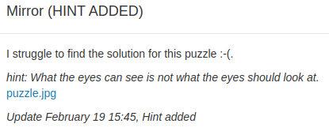

## Mirror

Ce challenge a clairement été créé pour mener à plusieurs fausses pistes.

Tout premièrement, j'ai analysé l'image et essayé de comprendre ce que pouvait signifier les chiffres, j'ai même retrouvé l'image originale utilisée mais c'était effectivement une fausse piste.

Il s'agissait simplement d'une chaine de caractère à la fin du fichier. Elle avait été ajoutée là après l'image, on peut la récupérer avec la commande "string" dans le terminal ou simplement en ouvrant le fichier avec un éditeur de texte et en allant à la dernière ligne.

V0NJX1NFQ180OTgz

Cette ligne est très peu indicative mais il s'agit en fait d'un grand classique des CTF, le base64 qui d'habitude est reconnaissable par les "=" à la fin pour le padding mais qui ne sont pas présent ici. Si on passe de base64 à ascii, on récupère:

WCI_SEC_4983
