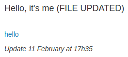

## Hello it's me



Le fichier donné dans ce challenge est un binaire exécutable qui print `Hello, World!`. Avant de décompiler le binaire on peut analyser le fichier et ça vaut effectivement la peine puisque la commande `strings hello` nous donne l'output suivant:

```
/lib64/ld-linux-x86-64.so.2
Au?f
libc.so.6
printf
__libc_start_main
__gmon_start__
GLIBC_2.2.5
UH-H
AWAVA
AUATL
[]A\A]A^A_
Hello, World!
;*3$"
WCI_SEC2_8943
GCC: (Ubuntu 5.4.0-6ubuntu1~16.04.12) 5.4.0 20160609
hello.c
long unsigned int
unsigned char
/home/kabaselendon/Documents/IEEE-SB/clubinfo_ctf2/challenges/challenge12
short int
hello.c
long int
sizetype
main
GNU C11 5.4.0 20160609 -mtune=generic -march=x86-64 -g -fstack-protector-strong
...
```

Et dans cet output, on voit clairement apparaitre `WCI_SEC2_8943` qui est le flag de l'épeuve.
