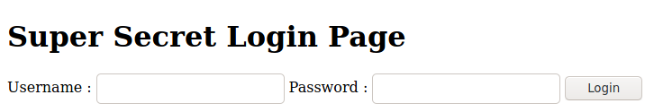

## KISS

Pour ce challenge, après avoir regardé en détail les réponses serveur, après avoir téléchargé le template de KISS original et regardé si il n'y avait aucune différence entre le template et les fichiers sur le serveur, nous avons décidé d'utiliser quelques outils.

Une fois que nous avions trouvé le bon outil, c'était évident que nous étions sur la bonne piste. Nous avons donc utilisé **wfuzz** pour tester des dictionnaires d'urls sur le site, mais cet outils ne vous donnera rien si vous cherchez à la racine du serveur.

Cependant, en observant bien l'url du site, on se rend compte qu'il est servi à partir d'un dossier `public`, on peut donc raisonnablement supposer qu'il existe un dossier `private`.

On a donc testé une commande du type `wfuzz <options dont je ne me souviens pas> <url moche>/private/FUZZ.html` avec un le dictionnaire `common.txt`.

En parsant les logs, on observe que l'on obtient un code 200 pour la page `administration.html` parmi tous les 404 pour les pages n'existant pas.
> Ceci n'a marché que lorsque les codes HTTP ont été réparés, sinon on avait du 200 pour toutes les pages qui n'existaient pas. Est-ce que l'on peut dire que c'est une méthode d'obfuscation ? En tout cas, cela nous a bloqué un petit moment.

On tombe sur cette page : 

Une première tentative d'injection SQL bête et méchante ne donne rien et on reste sur cette même page. Aussi, il devient clair que cette page ne communique pas avec le serveur.

En observant le contenu de la page, on se rend compte que le bouton `login` trigger du code Javascript (moche).

Après traduction du code avec [l'outil adéquat](http://codertab.com/jsunfuck), on obtient ceci: `if (document.forms[0].username.value == "kubEynine" && document.forms[0].password.value == "gOoDJobM4N") document.location = "comptability.html"`.

Cette ligne indique qu'il existe une seconde page cachée dans `/private`. Cette seconde page contient (discrètement) le flag :

