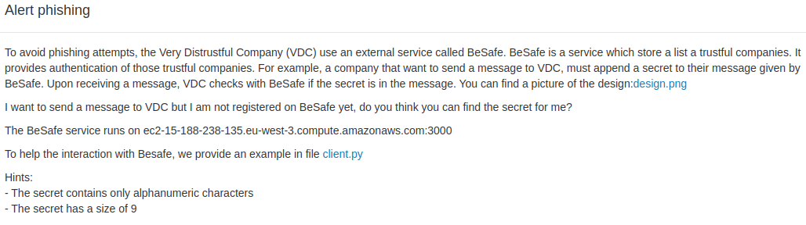

## Alert phishing



Pour attaquer ce challenge, j'ai utilisé le client.py qui est donné dans l'énoncé. J'ai vite compris qu'il ne faisait que envoyer un message au serveur concerné et il affiche le résultat tel que décrit dans l'image design.png:


La première chose à faire était d'identifier l'encryption utilisée étant donné que rien n'indique quel algo a été utilisé. J'ai donc commencé par envoyer 1000 fois la lettre "a". Et j'ai pu remarquer 2 choses, premièrement, l'algorithme est déterministe (si j'envoie 2 fois le même message, je reçois 2 fois la même réponse), ensuite le grand nombre de "a" dans mon message a donné un pattern qui se répétait dans le message chiffré.

send: 1000*"a"
received:

J'ai également observé que si j'augmentais l'input progressivement, l'output lui augmentait uniquement par bloc de 16 bytes et donc de 128 bits.

J'ai également noté que lorsqu'on envoyait une string vide on reçoit un bloc de 32 bytes et si on envoie 1 char, on reçoit directement un bloc de 48 bytes. Etant donné qu'on sait que le message S1 fait exactement 9 bytes (ou char) on en déduit que la valeur append au début de l'encryption fait 23 bytes. (ça nous servira plus tard)

Une fois que j'avais compris ça, j'ai pensé à ECB qui est le seul algo dans les standard qui correspond à cette description. (Une recherche sur google aurait suffit pour l'identifier.)

En cherchant un peu sur internet quelle était la faille de sécurité de ECB j'ai pu découvrir que sans connaitre la clef d'encryption, on pouvait extraire des informations sur le contenu d'un message exactement dans notre situation. Tout ça est expliqué [ici](https://crypto.stackexchange.com/questions/55673/why-is-byte-at-a-time-ecb-decryption-a-vulnerability).

J'ai donc cherché un code sur github qui exploitait déjà cette vulnérabilité et je l'ai modifié pour ajouter le client.py donné. J'ai également modifié le script pour qu'il rajoute 9 bytes (ou char) au début de chaque string qu'il enverra étant donné qu'il est décalé de 23 à cause de la valeur append au début.
Le script final donne ceci:

```python
import socket
import string
import binascii

HOST = "ec2-15-188-238-135.eu-west-3.compute.amazonaws.com"
PORT = 3000
CHARSET = string.ascii_letters + string.digits

def get_block_size(self):
    return 16

def guess_max_size_secret(self):
    return 9

def break_it(self):
    print("break it")
    while True:
        max_size_secret = guess_max_size_secret()
        try:
            secret = ""
            for size in range((max_size_secret - 1), -1, -1):
                origin = "A" * size
                origin_response = send_and_receive(origin)

                tmp = "A" * size + secret
                for character in CHARSET:
                    tmp_response = send_and_receive(tmp + character)

                    if origin_response[:max_size_secret] == tmp_response[:max_size_secret]:
                        print("secret add char: ", character)
                        secret += character
                        break
                if len(secret) == max_size_secret:
                    return secret
        except Exception as e:
            print(e)


def send_and_receive(msg):
    with socket.socket(socket.AF_INET, socket.SOCK_STREAM) as sock:
        sock.connect((HOST, PORT))
        # pre processing to do for the value to "hide" it!!
        msg = "a"*9 + msg
        resp = send_to_oracle(sock, msg)
        resp = resp[32:]
        return resp

def send_to_oracle(sock, msg):
    send_msg_to_oracle(sock, msg)
    out, _ = recv_msg(sock)
    return out

print(break_it())
```

Quand on le run, il output:
