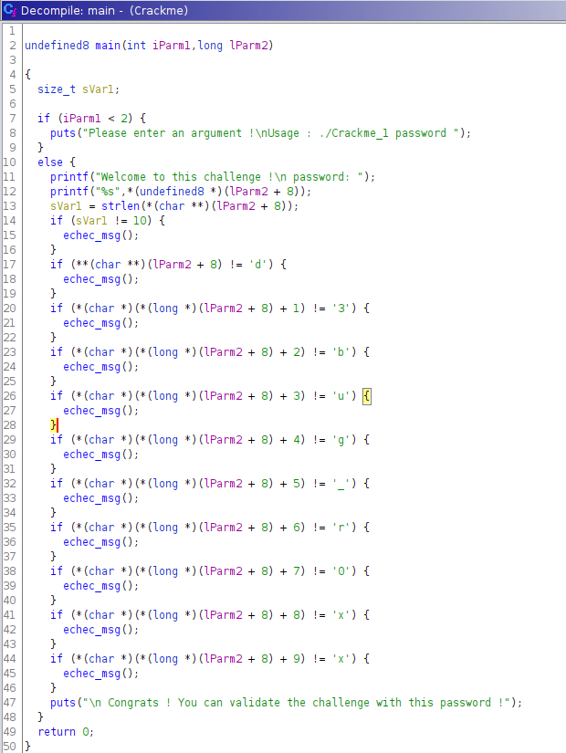

## Crack me if you can


Ce fichier est aussi un binaire exécutable et lorsqu'on l'exécute, on peut voir qu'il demande un argument. Quand on rentre un argument avec, le programme répond avec:

```
$ ./Crackme coucou
Welcome to this challenge !
 password: coucou
 Password is wrong !
```

On comprend donc que on doit réussir à trouver le bon mot de passe pour qu'il nous affiche le flag (et non la commande `strings` ne nous le retourne pas cette fois ci).

Il y a plusieurs méthode possible pour ça, mais ce que on avait fait c'est ouvrir **ghidra** pour qu'il nous décompile le binaire en code c. Après un peu d'inspection du code généré par ghidra, on peut observer dans la fonction main:



Ce qui nous permet de découvrir que il inspecte les arguments qu'il reçoit en les comparant lettre par lettre. En donnant ces charactères en argument, on peut donc voir qu'il nous suggère d'utiliser ce password comme flag:

```
./Crackme d3bug_r0xx
Welcome to this challenge !
 password: d3bug_r0xx
 Congrats ! You can validate the challenge with this password !
```
