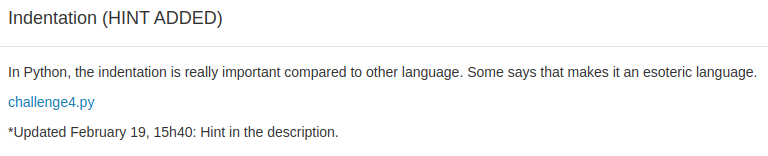
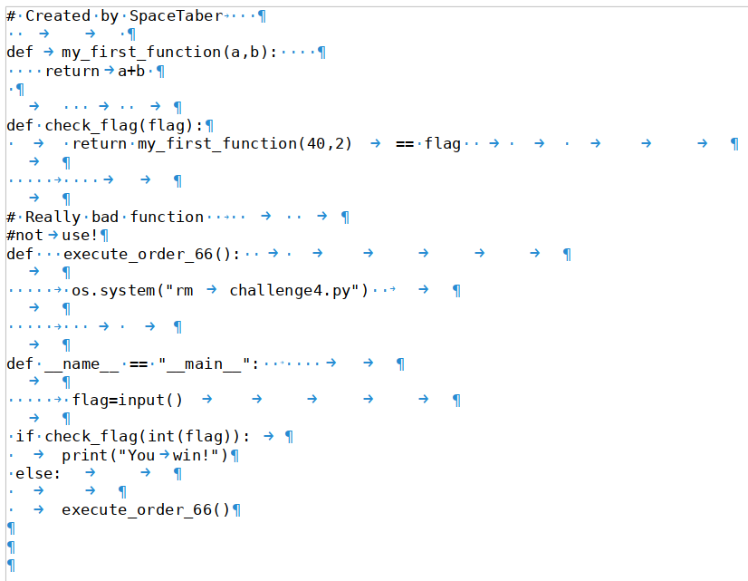
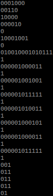

## Indentation



L'énoncé du challenge original indiquait uniquement que l'indentation en python est plus importante que dans d'autres langages.

Aussi, le plus simple et le plus rapide pour observer l'indentation dans le fichier est de l'ouvrir dans un traitement de texte (ici Libreoffice) et d'afficher la tabulation.

On obtient l'image ci dessous : 



A première vue le code ne fait aucun sens et ne pourrait même pas être exécuté 

```pytho
def __main__ == "__name__":
```

n'est effectivement pas la bonne notation pour lancer un main en python.

A ce stade on peut donc écarter le fond du fichier pour se concentrer sur sa forme. 

Une première hypothèse est que l'encodage est binaire, par exemple un espace vaut 0 et une tabulation vaut 1. Un script python écrit à la va-vite 

```python
d = open('challenge4.py').read()
m = ''
g = ''
for i in [j for j in d.split('\n') if j != '']:
    n = ''
    for k in i:
            if k == ' ':
                    n += '0'
            elif k == '\t':
                    n += '1'
    print(n)
    g += n
    c = chr(int(n,2))
    #print(c)
    m += c
print(m)
print(g)
```

permet d'extraire ces données :



Les valeurs encadrées par des 1 dans le milieu de la sortie sont la représentation binaire correcte de caractères ASCII encodés sur 8 bits et ayant un padding de 5 fois 0.
On obtient `WCI_SEC_` après décodage, ce qui correspond au début des flags du challenge. On sait également que l'on doit chercher une suite de chiffre à ajouter à la fin.

Après plusieurs fausses pistes, une simple recherche permet de découvrir l'existence du langage [Whitespace](https://en.wikipedia.org/wiki/Whitespace_%28programming_language%29). Après passage du code précédemment extrait dans un [interpréteur whitespace](http://vii5ard.github.io/whitespace/), on obtient `WCI_SEC_0626`.

